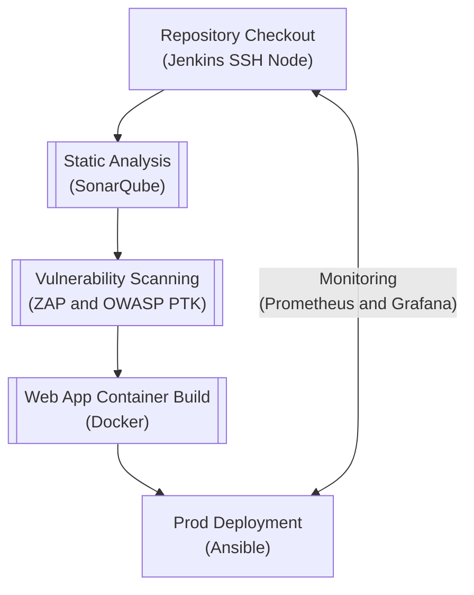

# DevSecOps Industry Best Practices

`17636-D | 2026 | Professor Jonathan Aldrich | Soobin Rho`

<br>

In this assignment, I learned how to deploy a web app using the industry best practices for DevSecOps.

<br>

| Service | Purpose |
| --------| ------- |
| **Jenkins** | Enables continuous integration and continuous delivery. |
| **SonarQube** | Performs static analysis on the codebase. |
| **ZAP (Zed Attack Proxy)** | Conducts vulnerability scanning and penetration testing on a live web application as a security analysis part of the DevSecOps. Supports a myriad of plugins including reporting generation tools and OWASP PTK (Penetration Testing Kit). |
| **Prometheus** | Metrics data collection toolkit. Also supports alerts based on custom rules. |
| **Grafana** | Monitoring and data visualization platform that can ingest data from Prometheus, Elasticsearch, Postgres, etc. |
| **Ansible** | Enables Infrastructure as Code. Used for deployment to the prod server. |

<br>

## Overview

The Jenkins instance polls this repository every minute and when a change is detected, it triggers a CI/CD pipeline as follows:

<br>
<!-- This wouldn't make sense if you're using a text editor to read this. -->
<!-- For better readability, plesae feel free to open this from my GitHub: -->
<!--   https://github.com/soobinrho/17636-devsecops-industry-best-practices -->


<br>

| Service | Location |
| --------| ------- |
| **Jenkins** | http://localhost:8080 |
| **SonarQube** | http://localhost:9000 |
| **ZAP (Zed Attack Proxy)** | http://localhost:8081 |
| **Prometheus** | http://localhost:9090 |
| **Grafana** | http://localhost:3000 |
| **Java Spring Petclinic Web App** | http://\<PROD\>:80 |

<br>

## Deployment

```bash
# ==================================
# How to deploy this CI/CD pipeline.
# ==================================
git clone https://github.com/soobinrho/17636-devsecops-industry-best-practices
cd 17636-devsecops-industry-best-practices

# The entirety of the piepeline has been scripted using Make. Under the hood,
# `./Makefile` deploys and configures Jenkins based on the user-defined username
# and password in `.env` and then creates a Jenkins SSH agent and connects this
# as a Jenkins node so that it can be used for all pipeline activities.

# All required Jenkins plugins are installed at Docker image build stage using
# the Jenkins Configuration as Code plugin, as well as all of the required username
# credentials (SSH private key for the Jenkins SSH agent and Jenkins login creds).
make start-build-pipeline

# ============================================
# [Optional] How to provision the prod server.
# ============================================
# For the prod server, Ansible will take care of the web app deployment steps, but
# the Ansible prerequisites need to be met.

# 1. Spin up the prod server. I used an Ubuntu image on VirtualBox for example.
# 2. Create a jenkins user.
useradd --create-home --password<PASSWORD> -s /bin/bash jenkins

# 3. Install Docker. I choose not to let Ansible do this because installing a package
#    like Docker via Ansible usually requires sudo privileges. This way, the jenkins
#    user does not need to have sudo privileges.
curl -fsSL https://get.docker.com -o get-docker.sh
sudo sh ./get-docker.sh
sudo usermod -aG docker jenkins

# 4. Instal the SSH server and OpenJDK.
sudo apt update
sudo apt install openssh-server default-jdk -y

# 5. Generate an SSH key pair and then add to the authorized users.
#    Then, add the private key to Jenkins credentials as `17636-prod-ssh-key`.
#    Also, add the prod server's location to `17636-prod-ansible-inventory`.
echo '<GENERATED_SSH_PUBLIC_KEY>' >> ~/.ssh/authorized_keys
```

<br>

## Useful Debugging Workflows

```bash
# A bug that took me hours to fix was where SonarQube container wasn't able to
# communicate with the Jenkins container even though they were placed in the
# same Docker Compose network. Whenever manual plumbing is required in cases
# like these, we can open up a shell session in each of the containers:
make test-sh-in-sonarqube
make test-sh-in-jenkins-ssh-agent
make test-sh-in-jenkins
make test-sh-in-zap
make test-sh-in-prometheus-node-exporter
make test-sh-in-postgr

# Whenever I implement a new feature, I use this one-liner to remove all Docker
# volumes, build all required Docker images, and deploy in a clean slate.
make reset

# How to check the logs of all the services deployed via Docker Compose.
make logs

# How to clean up all Docker volumes and images for this assignment afterwards.
make clean clean-remove-volumes clean-remove-images
```

<br>

## Resources

> Automation is critical to supply chain security. Automating as much of the software supply chain as possible can significantly reduce the possibility of human error and configuration drift ...
> <br><br>
> The build environments used in a supply chain should be clearly
defined, with limited scope. The human and machine identities operating
in those environments should be granted only the minimum permissions
required to complete their assigned tasks ...
> <br><br>
> All entities operating in the supply chain environment must be required to mutually authenticate using hardened authentication mechanisms with regular key rotation.
> <br><br>
> \- "Deployment and Operations for Software Engineers" by Len Bass and John Klein

<br>

- **The CNCF Security Technical Advisory Group's Supply Chain Best Practices**: https://github.com/cncf/tag-security#publications
- **NSA / CISA Kubernetes Hardening Guide**: https://media.defense.gov/2022/Aug/29/2003066362/-1/-1/0/CTR_KUBERNETES_HARDENING_GUIDANCE_1.2_20220829.PDF

<br>
